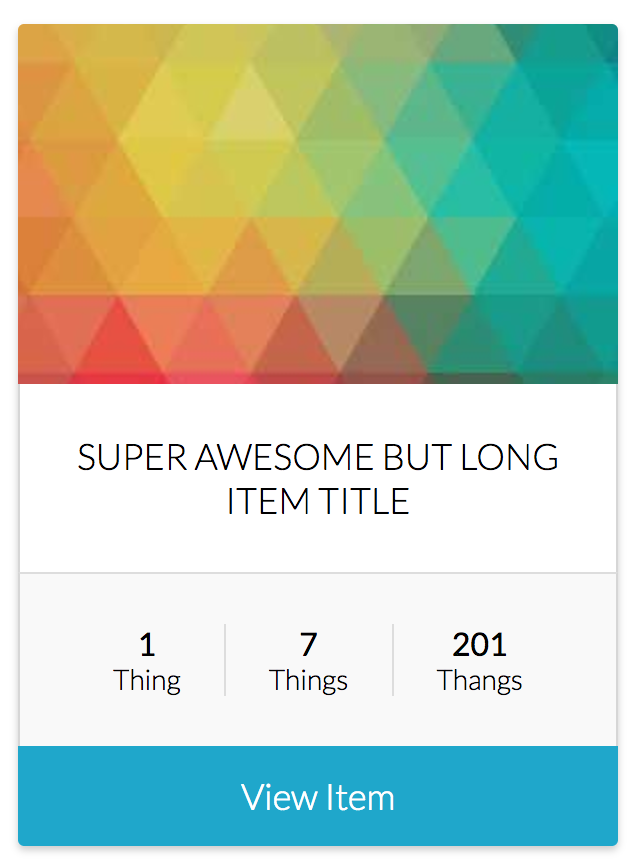
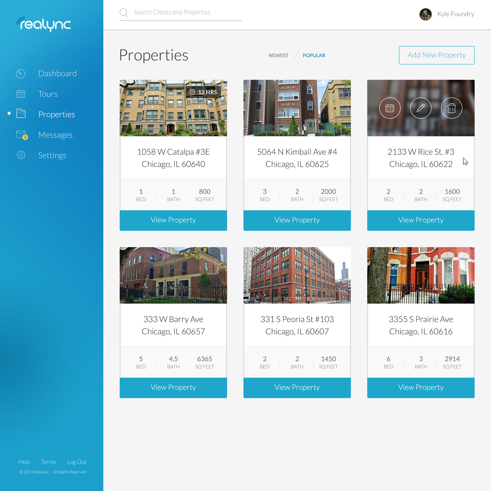

<h1>
  Item Tile 
</h1>
This item tile is the foundation that can be used for products, recipes, properties, etc. With clean, minimalistic markup and just a little bit of CSS, it is easily customizable, but should still save you some precious minutes of setup.

[View a Live Preview!](http://htmlpreview.github.io/?https://github.com/dfagan2/sandbox/blob/master/generic-widgets/item-tile/index.html)

# Usage

#### Screenshots

# Documentation.

#### Configuration

Lorem ipsum dolor sit amet, consectetur adipiscing elit. Sed sit amet quam sed orci mattis posuere. Proin sodales varius vestibulum. Nullam posuere elit ut nulla viverra consectetur. Maecenas vel enim venenatis, rhoncus tellus vitae, faucibus odio.Pellentesque eu purus cursus, fringilla dui vitae, ultricies risus. Duis tincidunt, sem vel accumsan interdum, leo nibh volutpat nisi, vel pharetra eros libero sed nunc. Aenean tortor neque, posuere eu massa sed, placerat vehicula velit. Etiam lobortis ipsum et libero congue semper. Sed nec ullamcorper erat. Suspendisse potenti. Duis venenatis fermentum gravida. Pellentesque id consectetur quam. Class aptent taciti sociosqu ad litora torquent per conubia nostra, per inceptos himenaeos. Maecenas sagittis nec tortor sed interdum. Duis suscipit hendrerit accumsan.

#### Dependencies

1. Lorem ipsum dolor sit amet
2. Lorem ipsum dolor sit amet
3. Lorem ipsum dolor sit amet

